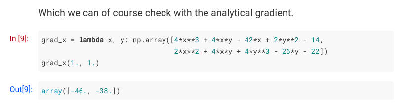

# Portfolio

[](https://app.netlify.com/sites/nikstoyanov/deploys)

The repository holds the content of my personal website [nikstoyanov.me](https://nikstoyanov.me).

Blog posts:
- Are done typically using Python or Julia in a Jupyter notebook which can be found in the /content/post directory.

To build:
- Add a new blog post with:

```
hugo new  --kind post post/my-article-name
```

- The run a bash file which exports the Jupyter notebook to markdown and appends it to an existing *.mmark file which holds the meta data for a blog post.

```bash
read -p "Folder path: " npath
read -p "Notebook name: " notebook
jupyter nbconvert $npath/$notebook.ipynb --execute --allow-errors --output-dir $npath --to markdown --template temp.tpl --ExecutePreprocessor.timeout=500 --NbConvertApp.output_files_dir=.
cat $npath/$notebook.md | tee -a $npath/index.mmark
rm $npath/$notebook.md
```

Which you can run from the main directory with:

```
./export.sh
```

To deploy:
- I host the website on [netlify](https://www.netlify.com/) for the continuous integration which builds the website on every push to this repository.

Jupyter formatting:
- By default the execution history does not get exported in markdown. To get the In[]/Out[] history of the cells like in Jupyter I had to modify the export template. The idea is to wrap the exported cells in a custom `<div>` which I can then style using custom CSS and pass as an argument to my build file.

The template can be found in the file *temp.tpl* and below:

```html

<div class="prompt input_prompt">
    
        In&nbsp;[{{ cell.execution_count|replace(None, "&nbsp;") }}]:
    
        In&nbsp;[&nbsp;]:
    
</div>

```

Which makes is looks like:



The static website is build using [Hugo](https://gohugo.io/) version 0.53 and the [academic]([https://themes.gohugo.io/hyde-hyde/](https://sourcethemes.com/academic/)) theme version 4.0.0.
